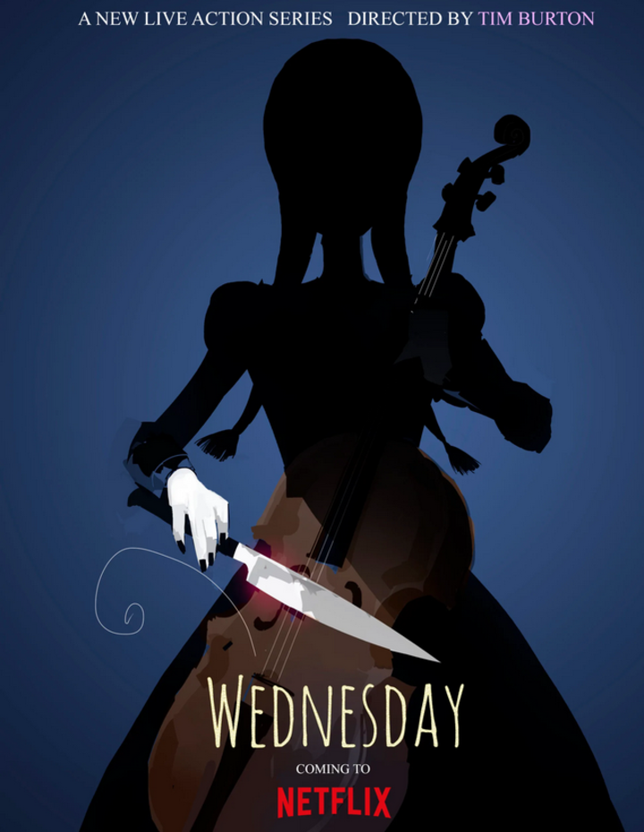
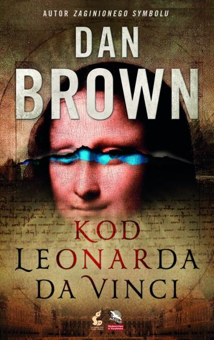

# Wednesday
Jest to najnowszy serail Tim'a Burton'a.
Serial Wednesday to amerykański serial będący połączeniem fantasy, zjawisk nadprzyrodzonych i komedii, którego bohaterką jest Wednesday Addams, która rozpoczyna naukę w Akademii Nevermore, mierząc się jednocześnie z wieloma problemami. Przede wszystkim z rodzącymi się w niej mocami psychicznymi, z nową szkołą i kolegami. 
Ale głównym celem nastolatki jest zmierzenie się z morderczą siłą, która terroryzuje okolice. Dziewczyna spróbuje zabawić się w detektywa i odkryć nadnaturalną zagadkę, która sięga przeszłości jej rodziców, a jej początek miał miejsce aż 25 lat temu. 
#### Obsada
- Jenna Ortega jako Wednesday Addams
- Emma Myers jako Enid

# Kod da Vinci
Film powstał na podstawie powieści o takim samym tytule, autorstwa Dan'a Brown'a.
Produkcja przedstawia losy znanego badacza z Harvardu, Roberta Langdona, który pilnie wezwany zostaje do francuskiego muzeum. Jak się okazuje, w popularnym Luwrze doszło do makabrycznego morderstwa kustosza muzeum. Okazuje się, że przed śmiercią mężczyzna zostawił pewne wskazówki dotyczące tego, czym się zajmował. 

Niebawem Langdon, którego własne bezpieczeństwo staje się zagrożone, wraz z policjantką Sophie Neveu próbują rozwiązać zagadkową śmierć mężczyzny. Niebawem wskazówki pozostawione przez kustosza doprowadzą ich do tajemniczego stowarzyszenia. 
#### Obsada
- Tom Hank jako Robert Langdon
- Audrey Tautou jako Sophie Neveu
- Paul Bethany jako Sylas

